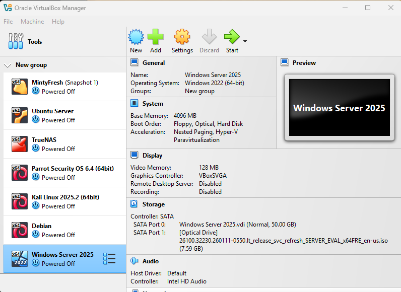
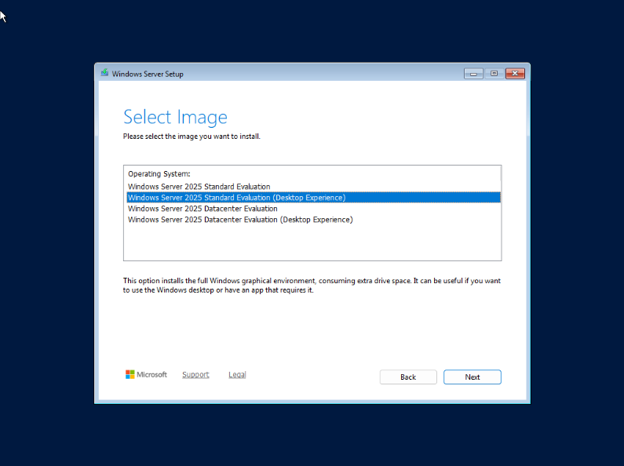

# Enterprise-Windows-Server-Lab
End-to-end enterprise on-premises Windows Server 2025 lab covering AD DS, DNS, DHCP, and GPOs
Project Overview
This project documents the deployment and configuration of a foundational enterprise-grade local infrastructure environment using **Oracle VirtualBox** and **Windows Server 2025 Standard (Desktop Experience)**.
In enterprise environments, hybrid and cloud architectures dominate, but understanding core on-premises legacy mechanics (Active Directory, DNS, and local Identity and Access Management) remains essential for IT support specialists, help desk technicians, and junior system administrators. This lab serves as a local simulation of an enterprise network domain.

Lab Architecture & Specifications
Host Operating System: Windows 11 Pro
Hypervisor: Oracle VirtualBox
Guest Operating System: Windows Server 2025 Standard Evaluation (Desktop Experience)
Allocated Resources: Base Memory (RAM): 4096 MB (4 GB)
Processor (CPU): 1 Virtual Core
Storage: Dynamically Allocated Virtual Hard Disk (Default settings)
Domain Structure (Planned): Ferdinand.local

Step-by-Step Deployment Instructions

Phase 1: Virtual Machine Creation in VirtualBox
 1. Launch **Oracle VirtualBox** on your Windows 11 host.
 2. Click the **New** button (blue gear/star icon) to open the Create Virtual Machine wizard.
 3. Configure the basic identification settings:
Name: Windows Server 2025
ISO Image: Select your downloaded Windows Server 2025 installation ISO.
Unattended Installation: Skip/bypass the automated setup to configure settings manually.
 4. Allocate system memory (**Base Memory: 4096 MB**) and processor cores (**1 CPU**).
 5. Configure the virtual hard disk by leaving it on its default setting (**Dynamically Allocated VDI file**).
 6. Review the summary page and click **Finish**.

Phase 2: Windows Server 2025 OS Installation
 1. Double-click the **Windows Server 2025** VM in your VirtualBox list to boot it up.
 2. If prompted to press any key to boot from CD/DVD, do so.
 3. Once the setup wizard loads, select your language, time/currency format, and keyboard layout, then click **Next**.
 4. Click **Install Now**.
 5. When prompted to select the operating system image, highlight:
**Windows Server 2025 Standard Evaluation (Desktop Experience)**
Note: Selecting the "Desktop Experience" variation ensures you install the full Server Manager graphical user interface rather than the headless Server Core command-line interface.
 6. Accept the license terms, choose **Custom: Install Windows only (advanced)**, and select the unallocated virtual drive to proceed with the file copy and installation.

Phase 3: First Boot & Authentication Trap Handling
 1. Once installation completes, the VM will restart and present the Windows Administrator password setup screen. Create a secure local administrator password.
 2. When the screen prompts you to log in, **do not press Ctrl + Alt + Delete directly on your physical keyboard**, as Windows 11 will intercept the command for your host machine's Task Manager.
 3. Instead, send the command directly to the virtual machine via the VirtualBox menu bar:
Navigate to the top menu: *Input* ➔ *Keyboard* ➔ *Insert Ctrl-Alt-Del* (or use the shortcut Host Key + Delete).
 4. Enter your administrator password to access the desktop.
 5. Bypass or close out of any initial hybrid cloud onboarding prompts (such as Azure Arc integration) to keep this environment strictly self-contained for local administration testing.

Next Steps for Lab Progression
With the base operating system and Server Manager dashboard active, the subsequent operational phases to complete your local lab include:
Configuring a static IP address on your Windows Server virtual machine.
 1. **IP Configuration:** Assigning a static IPv4 address to the virtual server's network adapter.
Installing the Active Directory Domain Services (AD DS) role via the Add Roles and Features wizard.
 2. **Role Installation:** Utilizing the *Add Roles and Features* wizard to install **Active Directory Domain Services (AD DS)** and **DNS Server** roles.
Promoting the server to a Domain Controller (e.g., establishing a custom root domain like ⁠Ferdinand.local⁠).
 3. **Domain Promotion:** Promoting the server to a Domain Controller for ferdinand.local to enable local user provisioning, group policies, and access control testing.

README.md: Initial Server Configuration & Domain Promotion (ferdinand.local)

Module 0: Pre-Domain Setup (Static IP & Server Identity)
Before installing Active Directory, your server must have a static IP address assigned so client machines can reliably find their DNS and Domain Controller.
Step 1: Rename the Server and Restart
 1. Open **Server Manager** and click on **Local Server** on the left menu.
 2. Click on the default computer name link (next to *Computer name*).
 3. Click **Change**, enter a new descriptive name (e.g., FERDINAND-DC01), and click **OK**.
 4. Restart the virtual machine when prompted.

Step 2: Configure a Static IPv4 Address
 1. Open the Windows Start menu, type **View network connections**, and open Control Panel's network settings.
 2. Right-click your network adapter and select **Properties**.
 3. Double-click **Internet Protocol Version 4 (TCP/IPv4)**.
 4. Select **Use the following IP address** and enter your static configuration (for example):
 **IP address:** 192.168.1.10
 **Subnet mask:** 255.255.255.0
 **Default gateway:** 192.168.1.1
 5. Under DNS servers, set the **Preferred DNS server** to your own static IP (192.168.1.10 or loopback 127.0.0.1) to ensure the server points to itself for name resolution. Click **OK**.

Module 0 (Continued): Installing AD DS and DNS Server Roles
Step 1: Launch the Add Roles and Features Wizard
 1. Open **Server Manager**.
 2. Click on **Manage** in the top-right toolbar, then select **Add Roles and Features**.
 3. Click **Next** past the Before You Begin splash screen.
 4. Ensure **Role-based or feature-based installation** is selected, and click **Next**.
 5. Select your server from the server pool list (FERDINAND-DC01) and click **Next**.

Step 2: Select Roles
 1. In the Server Roles list, check the box for **Active Directory Domain Services**.
 2. A popup will appear listing required management tools (like RSAT). Click **Add Features** to accept them.
 3. Check the box for **DNS Server** (the secondary popup for DNS tools will also appear; click **Add Features**).
 4. Click **Next** through the Features screen and the AD DS / DNS informational prompts.

Step 3: Confirm and Install
 1. Review your selections on the Confirmation screen.
 2. Check the box for **"Restart the destination server automatically if required"**.
 3. Click **Install** and wait for the feature file installation to complete.

Module 0 (Continued): Promoting the Server to a Domain Controller
Step 1: Initiate the Promotion Wizard
 1. Once the installation finishes, look at the top notification area of **Server Manager** (the yellow warning flag icon).
 2. Click the link that says **"Promote this server to a domain controller"**.

Step 2: Deployment Configuration
 1. In the Deployment Configuration window, select **Add a new forest**.
 2. Enter your root domain name:
**Root domain name:** Ferdinand.local
 3. Click **Next**.

Step 3: Domain Controller Options & DSRM Password
 1. Leave the functional levels at default (Windows Server 2016 or higher).
 2. Ensure **Domain Name System (DNS) server** and **Global Catalog (GC)** are checked.
 3. Enter a secure **Directory Services Restore Mode (DSRM)** password and confirm it (store this safely).
 4. Click **Next** past the DNS delegation warning (it is normal for a new forest root).

Step 4: Additional Options and Path Verification
 1. Accept the automatically generated NetBIOS domain name (FERDINAND). Click **Next**.
 2. Review the database, log files, and SYSVOL folder paths (leave defaults on Drive C:). Click **Next**.
 3. Review your configuration choices on the summary page and click **Next**.

Step 5: Prerequisite Check and Final Promotion
 1. Wait for the system to pass all prerequisite validation checks (warnings regarding cryptography requirements can be safely bypassed for lab environments).
 2. Click **Install**.
 3. The server will automatically execute the promotion scripts and force a system restart when complete.

1. User Account Lifecycle Management (Provisioning & Deprovisioning)
Onboarding: Creating new employee accounts, setting initial temporary passwords, assigning user principal names (UPNs), and placing users into appropriate Departmental Organizational Units (OUs).
Offboarding & Maintenance: Disabling compromised or terminated accounts, resetting locked out passwords, and updating attributes (such as phone numbers or department titles).
README.md (Continued): Step-by-Step Enterprise Core Lab Module
Module 1: User Account Lifecycle Management (Provisioning & Deprovisioning)
This module covers how junior administrators create, manage, and terminate user accounts within Active Directory to maintain corporate security compliance.
Step 1: Access Active Directory Users and Computers (ADUC)
 1. Open **Server Manager** on your Windows Server 2025 domain controller.
 2. Click on **Tools** in the top-right menu bar.
 3. Select **Active Directory Users and Computers (ADUC)** from the dropdown list.

Step 2: Create a Departmental Organizational Unit (OU)
 1. In the ADUC console, expand your domain name (e.g., Ferdinand.local).
 2. Right-click your domain, hover over **New**, and select **Organizational Unit**.
 3. Name the OU (e.g., IT_Support) and uncheck "Protect container from accidental deletion" if testing, then click **OK**.

Step 3: Provision a New User Account
 1. Right-click your new IT_Support OU, hover over **New**, and select **User**.
 2. Fill out the user details:
**First name:** Andre
**Last name:** Ferdinand
**User logon name:** AFerdinand
 3. Click **Next**, enter a secure temporary password, and configure the password options (e.g., check **"User must change password at next logon"** for security compliance).
 4. Click **Next**, review the summary, and click **Finish**.

2. Group & Permission Management (RBAC)
Security & Distribution Groups: Managing group memberships to control who has access to specific network resources, shared network folders, or printers.
Access Control Troubleshooting: Resolving tickets where a user can't open a shared folder by checking their group nesting and NTFS/share permissions.
README.md (Continued): Step-by-Step Enterprise Core Lab Module

Module 2: Group & Permission Management (RBAC)
This module focuses on role-based access control by organizing users into security groups and assigning appropriate network access permissions.
Step 1: Create a Department Security Group
 1. In **ADUC**, right-click your department OU (IT_Support), hover over **New**, and select **Group**.
 2. Configure the group settings:
Group name:** SG_HelpDesk_Access
Group scope:** Global
Group type:** Security
 3. Click **OK** to create the group.

Step 2: Add Users to the Security Group
 1. Double-click the newly created SG_HelpDesk_Access group and navigate to the **Members** tab.
 2. Click **Add...**, type the user's name (AFerdinand), and click **Check Names** to resolve it.
 3. Click **OK**, then click **Apply** and **OK** to save the membership.

Step 3: Configure Shared Folder NTFS Permissions
 1. On your server file system, create a folder named Shared_HelpDesk_Docs.
 2. Right-click the folder, select **Properties**, and navigate to the **Sharing** tab ➔ **Advanced Sharing**.
 3. Check **Share this folder**, then click **Permissions** and ensure SG_HelpDesk_Access has proper access levels (e.g., Read/Change).
 4. Navigate to the **Security** tab, click **Edit...**, add the SG_HelpDesk_Access group, and assign precise granular NTFS permissions (e.g., Modify/Read & execute).

3. Core Infrastructure Services (DNS & DHCP)
Name Resolution: Monitoring DNS zones to ensure client machines can properly resolve hostnames to IP addresses within the local domain.
IP Leasing: Managing scope leases to verify that newly connected devices on the corporate network successfully pull valid local IP configurations.
README.md (Continued): Step-by-Step Enterprise Core Lab Module
Module 3: Core Infrastructure Services (DNS & DHCP)
This module addresses network configuration, verifying internal name resolution, and dynamic IP lease allocations.
Step 1: Verify DNS Integration and Record Registration
 1. In **Server Manager**, click **Tools** and open the **DNS Manager** console.
 2. Expand your server name, click on **Forward Lookup Zones**, and select your domain zone (Ferdinand.local).
 3. Verify that host (A) records exist for your domain controller and joined client machines, ensuring proper internal name resolution.

Step 2: Configure DHCP Scope Parameters
 1. Open **Server Manager**, click **Tools**, and launch **DHCP Manager**.
 2. Expand your server, right-click **IPv4**, and select **New Scope**.
 3. Step through the wizard:
**Name:** Corp_DHCP_Scope
**IP Address Range:** Set a valid range (e.g., Start IP: 192.168.1.100 to End IP: 192.168.1.200) with the appropriate subnet mask length.
**Exclusions & Lease Duration:** Configure default settings (e.g., 8-day lease).
**Router (Default Gateway):** Input your gateway IP (e.g., 192.168.1.1).
**DNS Servers:** Verify your domain controller's static IP is designated as the primary DNS server.
 4. Select **Yes, I want to activate this scope now** and click **Finish**.

4. Group Policy Objects (GPOs) & Configuration Enforcement
Applying Policies: Deploying organization-wide settings such as desktop wallpaper locks, automatic screen timeouts, mapped network drives, and software installation policies across client workstations.
Troubleshooting Compliance: Running resultant set of policy (⁠gpresult⁠) diagnostics when a user workstation fails to apply security baselines.
README.md (Continued): Step-by-Step Enterprise Core Lab Module
Module 4: Group Policy Objects (GPOs) & Configuration Enforcement
This module details how administrators push out centralized configuration standards and security baselines to domain-joined workstations.
Step 1: Access Group Policy Management Console (GPMC)
 1. In **Server Manager**, click **Tools** and open **Group Policy Management**.
 2. Expand your forest and domain down to your target operational OU (IT_Support).

Step 2: Create and Link a New GPO
 1. Right-click your target OU (IT_Support) and select **Create a GPO in this domain, and Link it here...**.
 2. Name the GPO descriptively (e.g., Sec_Baseline_IT_Support) and click **OK**.

Step 3: Edit Policy Settings (Enforcing Configuration Standards)
 1. Right-click the newly created GPO (Sec_Baseline_IT_Support) and click **Edit...** to open the Group Policy Management Editor.
 2. Navigate down to configure a baseline setting:
**Path:** Computer Configuration ➔ Policies ➔ Windows Settings ➔ Security Settings ➔ Account Policies ➔ Account Lockout Policy
 3. Configure policy thresholds (e.g., set **Account lockout threshold** to 5 invalid login attempts).
 4. Close the editor. The policy is now actively linked and targeted to enforce configurations automatically across all user objects and machines within that organizational unit.
